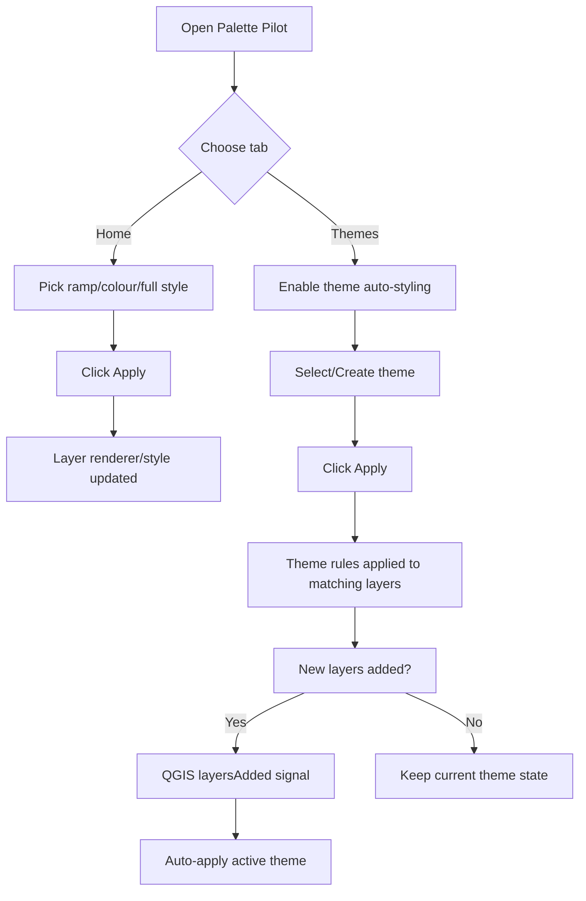
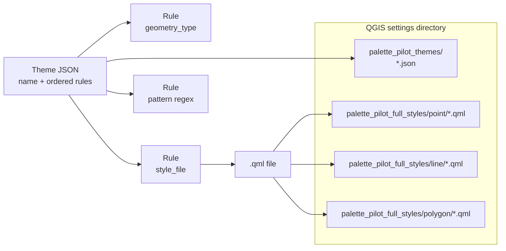
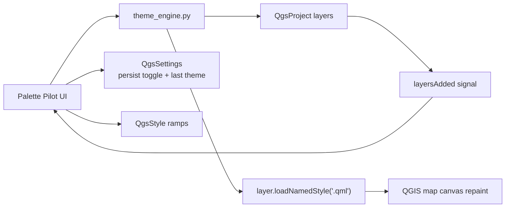

# Development workflow

How to set up your environment and iterate on the Palette Pilot plugin.

## One-time setup

1. **Environment (uv or fallback)**  
   Use **uv** (`uv venv`, then `uv sync` or `uv pip install -e ".[dev]"`) or the **pip** fallback (`python -m venv .venv`, then `pip install -r requirements-dev.txt`). The plugin runs in QGIS’s Python; the project venv is for linting, tests, and tooling only.

2. **QGIS**  
   Install QGIS 3.44 (or the same release series). The plugin runs in QGIS’s Python; your project venv is for linting, tests, and tooling only.

3. **Installing the plugin for development**  
   The plugin must sit in QGIS’s plugin directory so it appears in Plugin Manager. You can do that by hand or with the provided script.

   - **Option A — Script (recommended)**  
     From the repo root (with the repo cloned and QGIS installed):
     ```bash
     python3 scripts/install_plugin_for_dev.py
     ```
     This **copies** `palette_pilot` into the default QGIS plugin directory for your OS. After you pull changes, run the script again to refresh the copy (or reload the plugin in QGIS if supported).

     To use a **symlink** so edits in the repo are used directly (no copy step):
     ```bash
     python3 scripts/install_plugin_for_dev.py --symlink
     ```
     On Windows, symlinks may require elevated privileges; if it fails, use the default copy mode.

     If your plugin directory is not the default (e.g. you use a named profile), set it before running:
     ```bash
     # Windows (PowerShell)
     $env:QGIS_PLUGINS_PATH = "C:\Users\You\AppData\Roaming\QGIS\QGIS3\profiles\default\python\plugins"
     python3 scripts/install_plugin_for_dev.py

     # Linux / macOS
     export QGIS_PLUGINS_PATH=~/.local/share/QGIS/QGIS3/profiles/default/python/plugins
     python3 scripts/install_plugin_for_dev.py
     ```
     You can get the path from QGIS: **Plugins → Python Console** → see [installation.md — Method 2](installation.md#method-2-python-console).

     Other options: `--plugins-dir PATH`, `--dry-run` (print paths only).

   - **Option B — Manual copy or symlink**  
     Locate your plugin directory (see [installation.md — Finding your plugin directory](installation.md#finding-your-plugin-directory)). Copy or symlink the repo’s `palette_pilot` folder (the one containing `__init__.py` and `metadata.txt`) into that directory.

4. **Verify**  
   Start QGIS → **Plugins → Manage and Install Plugins → Installed** → enable **Palette Pilot**. Confirm it loads and a toolbar button or menu entry appears.

## Iteration

- Edit plugin code in the repo (in `palette_pilot/`).
- **Reload:** **Plugins → Manage and Install Plugins → Installed** → disable then re-enable the plugin, or restart QGIS if reload is not available.
- Use the **Debugging** workflow below when you need breakpoints or deeper inspection.

## Code quality

From the project root with the venv activated:

- Lint: `pylint palette_pilot` (or `ruff check palette_pilot` if using Ruff).
- Format: `black palette_pilot` (or `ruff format palette_pilot`).
- Tests: `uv run python -m unittest discover tests -v` (or `python3 -m unittest discover tests -v`).
  - `test_qt_compat.py` — verifies the Qt5/Qt6 and QGIS 3/4 compatibility shim (`qt_compat.py`) resolves all enum constants correctly under both mock environments. No QGIS installation needed.

Fix issues before committing.

## Debugging

The plugin runs inside QGIS, so debugging is done against the QGIS process.

### Attach to QGIS (recommended for breakpoints)

1. Install `debugpy` into **QGIS’s Python** (not the project venv). Use QGIS’s Python path (e.g. from **Plugins → Python Console** run `import sys; print(sys.executable)`).
2. In plugin code, at the point where you want to stop, add:
   ```python
   import debugpy
   debugpy.listen(5678)
   debugpy.wait_for_client()
   ```
   Or use `breakpoint()` if your IDE is set to attach to the process.
3. Start QGIS, trigger the code path (e.g. click the plugin toolbar button), then in your IDE use **Python: Attach** (or equivalent) to attach to `localhost:5678` or the QGIS process.
4. Document your OS, QGIS version, and exact steps in this file or in [docs/debugging.md](debugging.md) so others can reproduce.

### QGIS Python Console

For quick checks without a full attach: **Plugins → Python Console**, then import the plugin module or run snippets that call into it. Use `print()` or logging. Not full breakpoint debugging but sufficient for many issues.

### Logging

The plugin uses `QgsMessageLog` or Python `logging`. Logs appear in **View → Panels → Log Messages**. Document how to enable debug level for user reports.

## Contributing and translations

To add or update translations, see the [Translations](../README.md#translations) section in the main README. Source files are in `palette_pilot/i18n/` (`.pro` and `.ts` files); use `self.tr("…")` in plugin code for user-visible strings so `pylupdate5` can extract them.

## Development tooling note

Palette Pilot has been developed with AI-assisted workflows in both **Cursor** and **GitHub Copilot (Claude Opus 4.6)**.

## Quick concept diagrams

### 1) Workflow: Home tab to Theme application



### 2) Data model and plugin directory tree



### 3) Integration with existing QGIS infrastructure


